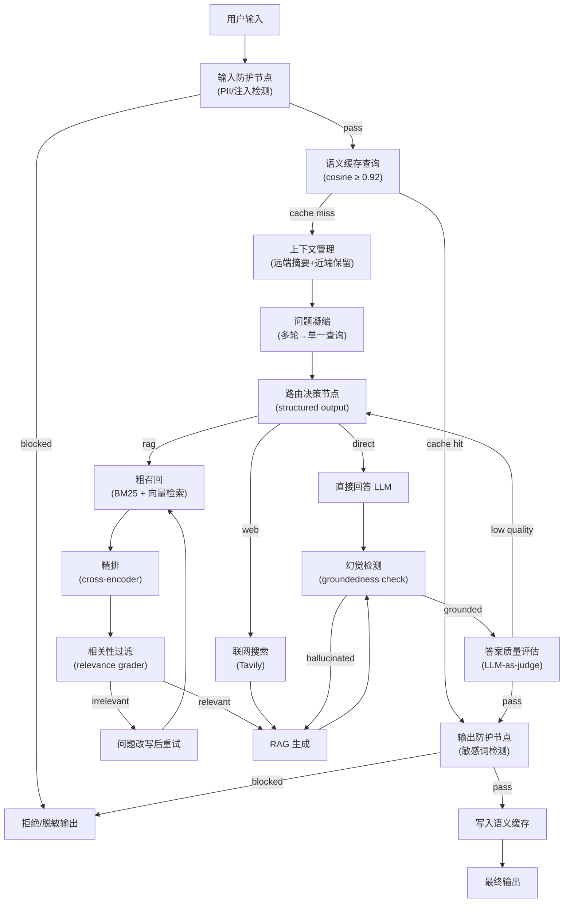

# LangGraph Agent 全链路架构规划

## 一、脚手架（对标 `npm init vite@latest`）

LangGraph 官方提供了 `langgraph-cli`，用法与前端脚手架完全一致：

```bash
# 方式一：用 uvx 免安装直接拉模板（推荐）
uvx --from langgraph-cli@latest langgraph new my-agent --template new-langgraph-project-python

# 方式二：全局安装后使用
pip install langgraph-cli
langgraph new my-agent   # 不带 --template 会弹出交互菜单

# 启动本地开发服务（热重载，内置 LangGraph Studio UI）
cd my-agent
langgraph dev
```

可用模板：
- `new-langgraph-project-python` — 最小骨架，单节点可扩展
- `agent` — 标准 ReAct Agent
- `deep-agent` — 多子 Agent + 规划/委派/批评/终稿工作流

---

## 二、整体数据流



---

## 三、节点 → 库 对照表

- **输入防护** — `nemo-guardrails` 或自定义正则/`presidio-analyzer`(PII)
- **语义缓存** — `langchain-redis`(`RedisSemanticCache`) 或 `faiss-cpu`+自写余弦缓存
- **上下文管理（远端压缩+近端保留）** — `langchain` `ConversationSummaryBufferMemory` + LangGraph `MemorySaver` checkpointer
- **问题凝缩** — `langchain` `create_history_aware_retriever` 或自定义 condensing chain
- **路由决策** — LangGraph 条件边 + LLM structured output (`pydantic` schema)
- **粗召回** — `rank-bm25` + `chromadb`/`qdrant-client` 混合检索
- **精排** — `flashrank` 或 `sentence-transformers` cross-encoder
- **相关性过滤** — CRAG 风格 `GradeDocuments` structured output node
- **联网搜索** — `tavily-python` 或 `duckduckgo-search`
- **幻觉检测** — `ragas`(`faithfulness`) 或 LLM-as-judge groundedness node
- **答案质量评估** — `ragas`(`answer_relevancy`, `answer_correctness`) 或自定义评分节点
- **输出敏感词检测** — `better-profanity` 或自定义词表 + `nemo-guardrails` output rails
- **服务层** — `fastapi` + `uvicorn`

---

## 四、完整依赖清单（`requirements.txt`）

```
# 核心框架
langgraph>=0.3
langchain>=0.3
langchain-openai>=0.2        # 或 langchain-anthropic / langchain-community
langchain-text-splitters>=0.3

# 向量数据库
chromadb>=0.6                # 本地优先；生产可换 qdrant-client
# qdrant-client>=1.11

# 检索
rank-bm25>=0.2               # 词法检索
sentence-transformers>=3.0   # embedding + cross-encoder 精排
flashrank>=0.2               # 轻量 cross-encoder 精排

# 语义缓存
redis>=5.0
langchain-redis>=0.2         # RedisSemanticCache

# 联网搜索
tavily-python>=0.5

# 上下文管理 / 记忆
langgraph-checkpoint-sqlite>=2.0  # 本地 checkpointer

# 防护 & 安全
nemo-guardrails>=0.11        # 输入/输出 rails
presidio-analyzer>=2.2       # PII 检测
presidio-anonymizer>=2.2
better-profanity>=0.7        # 敏感词

# 评估
ragas>=0.2                   # 幻觉检测 + 质量评估

# 服务 & 工具
fastapi>=0.115
uvicorn[standard]>=0.32
pydantic>=2.7
python-dotenv>=1.0
```

---

## 五、项目目录结构

```
my-agent/
├── langgraph.json           # LangGraph CLI 配置（导出 graph）
├── .env                     # API Keys
├── requirements.txt
├── src/
│   └── agent/
│       ├── graph.py         # 主 StateGraph 组装
│       ├── state.py         # AgentState Pydantic 定义
│       ├── nodes/
│       │   ├── guardrails.py        # 输入/输出防护
│       │   ├── cache.py             # 语义缓存读写
│       │   ├── context_manager.py   # 上下文压缩+保留
│       │   ├── router.py            # 路由决策
│       │   ├── retrieval.py         # 粗召回+精排+相关性过滤
│       │   ├── web_search.py        # 联网搜索
│       │   ├── generate.py          # RAG 生成/直接回答
│       │   └── evaluator.py         # 幻觉检测+质量评估
│       └── tools/
│           └── search_tool.py
└── tests/
```

---

## 六、快速启动命令

```bash
# 1. 脚手架
uvx --from langgraph-cli@latest langgraph new my-agent --template new-langgraph-project-python
cd my-agent

# 2. 安装依赖（推荐 uv）
uv pip install -r requirements.txt

# 3. 本地开发（带 Studio UI）
langgraph dev

# 4. 生产部署
langgraph build
langgraph deploy
```
